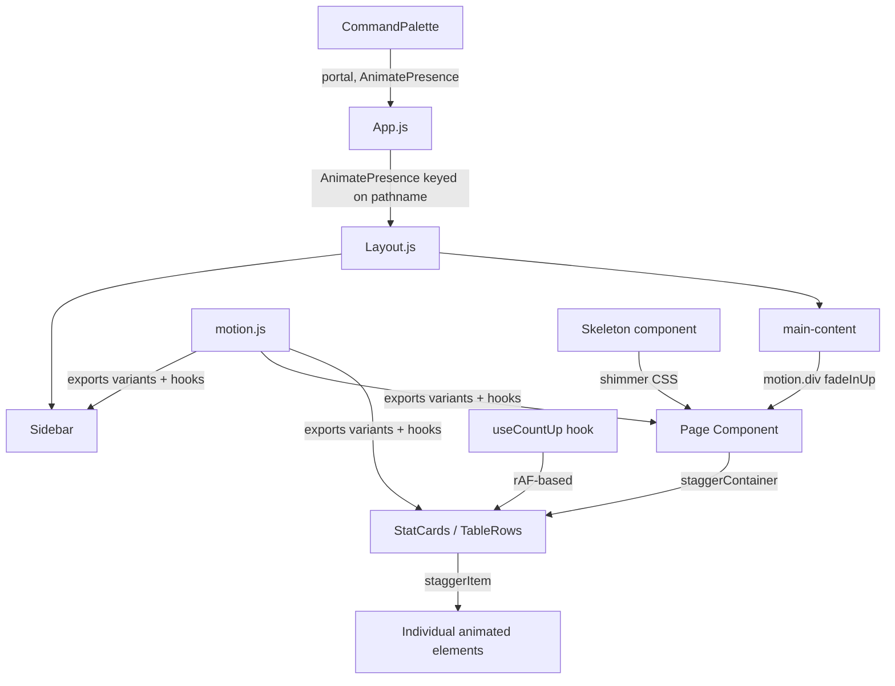

# Design Document: UI Redesign & Animations

## Overview

This design covers a complete UI animation overhaul for LibasTrack — a React/CSS-based business management app for fashion brands. The goal is to layer a cohesive, premium motion language on top of the existing design system without touching data flows or backend contracts.

The approach is additive: we introduce a centralised motion utility (`motion.js`), wrap existing components with Framer Motion primitives, and add new components (Skeleton, CommandPalette, useCountUp hook) that slot into the existing architecture. All existing CSS design tokens, class names, and component APIs are preserved.

**Key constraints:**
- Framer Motion 10.16.4 is already installed — no new animation dependencies needed
- All animations must respect `prefers-reduced-motion`
- Only `transform` and `opacity` are animated (GPU-composited) except the intentional sidebar width transition
- Mobile behaviour at `< 768px` is preserved throughout

---

## Architecture

The animation system is structured in three layers:

```
┌─────────────────────────────────────────────────────┐
│  Layer 3: Page-level orchestration                  │
│  AnimatePresence (App.js), stagger containers       │
├─────────────────────────────────────────────────────┤
│  Layer 2: Component-level motion                    │
│  motion.div wrappers, whileHover/whileTap, layoutId │
├─────────────────────────────────────────────────────┤
│  Layer 1: Motion System Foundation                  │
│  frontend/src/utils/motion.js — variants, hooks     │
└─────────────────────────────────────────────────────┘
```

**Data flow is unchanged.** Pages still fetch from the API via `axios`, store state with `useState`/`useEffect`, and render the same JSX structure. Motion wrappers are applied around existing elements.



---

## Components and Interfaces

### 1. `frontend/src/utils/motion.js` — Motion System Foundation

Central export of all shared animation variants and the reduced-motion utility.

```js
// Reduced-motion detection (called once at module load)
const prefersReducedMotion = () =>
  window.matchMedia('(prefers-reduced-motion: reduce)').matches;

// Shared transition defaults
export const transition = {
  duration: 0.3,
  ease: [0.4, 0, 0.2, 1],
  type: 'tween',
};

// Named variants
export const fadeIn = { ... };
export const fadeInUp = { ... };
export const fadeInDown = { ... };
export const scaleIn = { ... };
export const slideInLeft = { ... };
export const slideInRight = { ... };
export const staggerContainer = { ... };
export const staggerItem = { ... };
```

When `prefersReducedMotion()` is true, all variants substitute their `y`/`x`/`scale` values with `0` and set `transition.duration` to `0.01`.

### 2. `frontend/src/hooks/useCountUp.js` — Count-Up Hook

A custom hook that animates a number from 0 to a target value using `requestAnimationFrame`.

```ts
function useCountUp(target: number, duration: number = 1000): number
```

- Uses `requestAnimationFrame` exclusively (no `setInterval`)
- Returns the current animated value as a number
- Respects reduced-motion: returns `target` immediately when preferred
- Cancels the rAF loop on unmount via cleanup in `useEffect`

### 3. `frontend/src/components/Skeleton.js` — Skeleton Loading Component

```tsx
interface SkeletonProps {
  width?: string | number;
  height?: string | number;
  borderRadius?: string | number;
  className?: string;
}
```

Renders a `div` with a shimmer animation. The shimmer uses a `::after` pseudo-element with `transform: translateX(-100%)` → `translateX(100%)` keyframe animation (GPU-composited). Uses `var(--bg-layer2)` base and `var(--bg-layer3)` highlight.

### 4. `frontend/src/components/CommandPalette.js` — Command Palette

A portal-rendered overlay component triggered by `Ctrl+K` / `Cmd+K`.

```tsx
interface CommandPaletteProps {
  isOpen: boolean;
  onClose: () => void;
}
```

**Internal structure:**
- `overlay` — full-screen backdrop with `backdrop-filter: blur(12px)`, closes on click
- `panel` — centred modal (bottom sheet on `< 480px`) with glassmorphism styling
- `search input` — auto-focused on open, filters items in real time
- `results list` — keyboard-navigable with `ArrowUp`/`ArrowDown`, `Enter` to select

**Items list** is built from the `NAV` array in `Layout.js` plus the `QUICK_ACTIONS` from `Dashboard.js`. Both are extracted to a shared `frontend/src/utils/navItems.js` constant so `CommandPalette` and `Layout`/`Dashboard` can import from the same source.

**Filtering:** simple case-insensitive `includes` check on item label and description. Runs synchronously — no debounce needed for this list size.

**Lifecycle:** mounted only when `isOpen` is true (via `AnimatePresence` + conditional render), so the DOM node is absent when closed.

### 5. `frontend/src/components/Layout.js` — Updated Layout

Changes from current:
- Sidebar width driven by a `collapsed` state (persisted to `localStorage`)
- `main-content` `margin-left` animated in sync with sidebar width via Framer Motion `animate` prop
- `AnimatePresence` wrapping the `<Outlet />` keyed on `location.pathname`
- Mobile overlay sidebar behaviour preserved unchanged
- `CommandPalette` rendered here with a `keydown` listener for `Ctrl+K`

### 6. Page Header Enhancement

A `PageHeader` component (or inline pattern) that:
- Wraps title in `motion.h1` with `fadeInDown` variant
- Wraps subtitle/actions in `motion.div` with `fadeInUp` and a `0.05s` delay
- Uses a `useScrollY` hook to detect scroll > 40px and apply `backdrop-filter: blur(12px)` + border

### 7. Animated Table Rows

Table `tbody` rows wrapped in `motion.tr` with:
- `variants={staggerItem}` for entrance stagger
- `exit` animation: `height: 0, opacity: 0` over 0.25s (the one intentional layout-property animation for delete UX)
- `AnimatePresence` wrapping the `tbody` to handle row add/remove

---

## Data Models

No new data models are introduced. The animation system is purely presentational.

**localStorage keys used:**
- `sidebar_collapsed` — `"true"` | `"false"` — sidebar collapse preference
- `lt_theme` — `"dark"` | `"light"` — existing theme preference (unchanged)

**Shared navigation data structure** (extracted to `navItems.js`):

```js
// frontend/src/utils/navItems.js
export const NAV_ITEMS = [
  { label: 'Dashboard', to: '/dashboard', icon: '▦', section: 'Overview' },
  { label: 'Orders', to: '/orders', icon: '◫', section: 'Commerce' },
  // ... all nav items
];

export const QUICK_ACTIONS = [
  { label: 'New Order', desc: 'Record a sale', icon: '◫', to: '/orders' },
  // ... all quick actions
];
```

**Motion variant shape** (all variants follow this pattern):

```js
{
  hidden: { opacity: 0, y: 12 },   // initial state
  visible: {                        // animate-to state
    opacity: 1,
    y: 0,
    transition: { duration: 0.3, ease: [0.4, 0, 0.2, 1] }
  },
  exit: { opacity: 0, y: -8, transition: { duration: 0.2 } }
}
```

---

## Correctness Properties

*A property is a characteristic or behavior that should hold true across all valid executions of a system — essentially, a formal statement about what the system should do. Properties serve as the bridge between human-readable specifications and machine-verifiable correctness guarantees.*

### Property 1: All required motion variants are exported

*For any* name in the required variant set (`fadeIn`, `fadeInUp`, `fadeInDown`, `scaleIn`, `slideInLeft`, `slideInRight`, `staggerContainer`, `staggerItem`), the `motion.js` module must export a non-null object with that name.

**Validates: Requirements 1.1**

---

### Property 2: Reduced-motion collapses all animation durations

*For any* variant exported from `motion.js`, when `prefers-reduced-motion` is active (mocked via `matchMedia`), the effective transition duration for that variant must be ≤ 0.01 seconds, and all translate/scale values must be 0.

**Validates: Requirements 1.4, 15.1**

---

### Property 3: Motion variants use only GPU-composited properties

*For any* variant in `motion.js` (excluding the sidebar width variant), the animated CSS properties must be limited to `opacity`, `x`, `y`, `scale`, and `rotate` — never `width`, `height`, `top`, `left`, or `margin`.

**Validates: Requirements 15.2**

---

### Property 4: Count-up hook produces values from 0 to target

*For any* positive numeric target value passed to `useCountUp`, the sequence of values produced during the animation must start at 0 and monotonically increase, ending at the target value.

**Validates: Requirements 5.2, 12.3**

---

### Property 5: Count-up hook uses requestAnimationFrame

*For any* invocation of `useCountUp` with a positive target, the animation must schedule updates via `requestAnimationFrame` and must not call `setInterval`.

**Validates: Requirements 15.6**

---

### Property 6: Skeleton accepts and applies arbitrary dimension props

*For any* valid `width`, `height`, and `borderRadius` values passed to the `Skeleton` component, the rendered element must have those exact styles applied.

**Validates: Requirements 4.5**

---

### Property 7: Pages show skeletons while loading and content after

*For any* page component that has a `loading` state, when `loading` is `true` skeleton elements must be present and no real data content rendered; when `loading` transitions to `false`, skeleton elements must be absent and real content must be present.

**Validates: Requirements 4.1, 4.4**

---

### Property 8: Command palette filters results correctly

*For any* non-empty search string typed into the command palette, every item in the displayed results list must contain that string (case-insensitive) in its label or description. No non-matching items may appear.

**Validates: Requirements 7.4**

---

### Property 9: Command palette contains all navigation destinations

*For any* item defined in `NAV_ITEMS`, that item must be findable in the command palette's full (unfiltered) item list.

**Validates: Requirements 7.5**

---

### Property 10: Command palette keyboard navigation cycles through all results

*For any* list of `n` visible results in the command palette, pressing `ArrowDown` exactly `n` times from the first item must cycle through all items and return to the first (wrap-around), and `ArrowUp` must cycle in reverse.

**Validates: Requirements 7.9**

---

### Property 11: Command palette DOM node is absent when closed

*For any* close action (Escape key, outside click, Enter on a result), after the close animation completes the command palette DOM node must not be present in the document.

**Validates: Requirements 15.4**

---

### Property 12: Sidebar collapse state persists to localStorage

*For any* sequence of collapse/expand toggle operations, the value stored in `localStorage` under key `sidebar_collapsed` must equal the current collapsed state after each toggle.

**Validates: Requirements 3.5**

---

### Property 13: Collapsed sidebar shows tooltips for all nav items

*For any* nav item when the sidebar is in collapsed mode, hovering that item must display a tooltip whose text exactly matches the item's label.

**Validates: Requirements 3.3**

---

### Property 14: Page header blur responds to scroll position

*For any* scroll position greater than 40px, the page header must have `backdrop-filter: blur(12px)` applied; for any scroll position ≤ 40px, the blur must be 0.

**Validates: Requirements 9.4**

---

### Property 15: Table row deletion triggers exit animation

*For any* table row, triggering its deletion must cause the row to play its exit animation (height collapse + opacity fade) before being removed from the DOM.

**Validates: Requirements 10.2**

---

### Property 16: New table rows animate in on addition

*For any* new record added to a table, the corresponding row must play the `fadeInDown` entrance animation when it first appears in the DOM.

**Validates: Requirements 10.3**

---

### Property 17: Command palette displays as bottom sheet on narrow viewports

*For any* viewport width less than 480px, the command palette panel must use bottom-sheet positioning (anchored to the bottom of the viewport) rather than centred modal positioning.

**Validates: Requirements 14.5**

---

### Property 18: Toast progress bar is present for any timed toast

*For any* toast rendered with a finite display duration, a progress bar element must be present within the toast and its visual width must decrease over the display duration.

**Validates: Requirements 13.3**

---

## Error Handling

**Animation failures** — Framer Motion is resilient; if a variant is missing a key, it silently skips that property. No user-visible errors result from misconfigured variants.

**`localStorage` unavailability** — The sidebar collapse persistence wraps `localStorage` access in a `try/catch`. If storage is unavailable (private browsing, quota exceeded), the sidebar defaults to expanded mode without throwing.

**`matchMedia` unavailability** — SSR or test environments may not have `window.matchMedia`. The `prefersReducedMotion()` utility guards with `typeof window !== 'undefined' && window.matchMedia` before calling, defaulting to `false` (motion enabled) if unavailable.

**Command palette navigation errors** — If `navigate(to)` throws (e.g. invalid route), the palette still closes. The error is caught and logged to console without surfacing to the user.

**Count-up with non-numeric values** — `useCountUp` receives a `number` type. If a non-numeric stat value is passed (e.g. a formatted currency string), the hook returns `0` and the formatted string is displayed directly without animation. Pages should pass the raw numeric value to `useCountUp` and format the result.

**Recharts animation** — `isAnimationActive` is set to `true` by default in Recharts. If the data array is empty, no animation runs and no error is thrown.

---

## Testing Strategy

### Unit Tests (Jest + React Testing Library)

Focus on specific examples, edge cases, and component contracts:

- `motion.js` — verify all 8 required variant names are exported; verify `transition` object shape
- `useCountUp` — verify it starts at 0, ends at target, uses rAF (mock `requestAnimationFrame`), returns target immediately when reduced-motion is mocked
- `Skeleton` — verify props are applied as inline styles; verify shimmer CSS class is present
- `CommandPalette` — verify open/close on keyboard shortcuts; verify focus management; verify Escape closes; verify outside click closes; verify bottom-sheet class at narrow viewport
- `Layout` — verify `sidebar_collapsed` is read from localStorage on mount; verify it is written on toggle
- `PageHeader` — verify blur class is applied after scroll > 40px

### Property-Based Tests (fast-check)

The property-based testing library for this project is **[fast-check](https://github.com/dubzzz/fast-check)** (JavaScript/TypeScript, works with Jest).

Each property test runs a minimum of **100 iterations**.

Tag format: `// Feature: ui-redesign-animations, Property N: <property text>`

**Properties to implement as PBT:**

| Property | Test file | Arbitraries |
|---|---|---|
| P1: All required variants exported | `motion.test.js` | `fc.constantFrom(...variantNames)` |
| P2: Reduced-motion collapses durations | `motion.test.js` | `fc.constantFrom(...variantNames)` |
| P3: GPU-composited properties only | `motion.test.js` | `fc.constantFrom(...variantNames)` |
| P4: Count-up 0→target monotonically | `useCountUp.test.js` | `fc.integer({ min: 1, max: 1_000_000 })` |
| P5: Count-up uses rAF | `useCountUp.test.js` | `fc.integer({ min: 1, max: 9999 })` |
| P6: Skeleton applies dimension props | `Skeleton.test.js` | `fc.integer`, `fc.string` for CSS values |
| P7: Pages show skeletons while loading | `pages.test.js` | `fc.constantFrom(...pageComponents)` |
| P8: Command palette filters correctly | `CommandPalette.test.js` | `fc.string()` for search queries |
| P9: Command palette contains all nav items | `CommandPalette.test.js` | `fc.constantFrom(...NAV_ITEMS)` |
| P10: Keyboard navigation cycles results | `CommandPalette.test.js` | `fc.integer({ min: 1, max: 20 })` for result count |
| P11: Palette DOM absent when closed | `CommandPalette.test.js` | `fc.constantFrom('escape', 'outside', 'enter')` |
| P12: Sidebar collapse persists to localStorage | `Layout.test.js` | `fc.array(fc.boolean())` for toggle sequences |
| P13: Collapsed sidebar tooltips | `Layout.test.js` | `fc.constantFrom(...NAV_ITEMS)` |
| P14: Header blur on scroll | `PageHeader.test.js` | `fc.integer({ min: 0, max: 2000 })` for scroll position |
| P15: Row deletion exit animation | `Table.test.js` | `fc.array(fc.record(...))` for table data |
| P16: New row entrance animation | `Table.test.js` | `fc.record(...)` for new row data |
| P17: Command palette bottom sheet on narrow viewport | `CommandPalette.test.js` | `fc.integer({ min: 320, max: 479 })` for viewport width |
| P18: Toast progress bar present | `Toast.test.js` | `fc.integer({ min: 1000, max: 10000 })` for duration |

### Integration Tests

- Full page render with mocked API: verify skeleton → content transition on Dashboard, Orders, Products, Customers, Financial, Suppliers, Returns
- Theme toggle: verify `data-theme` attribute changes and CSS transitions are applied
- Command palette end-to-end: open → type → navigate → verify route change

### Visual / Manual Tests

- Sidebar collapse animation smoothness
- Page transition cross-fade (no FOUC)
- Glassmorphism rendering on Command Palette overlay
- Noise texture on sidebar background
- Recharts animation on Financial page
- Toast slide-in from bottom-right
- Mobile overlay drawer animation
